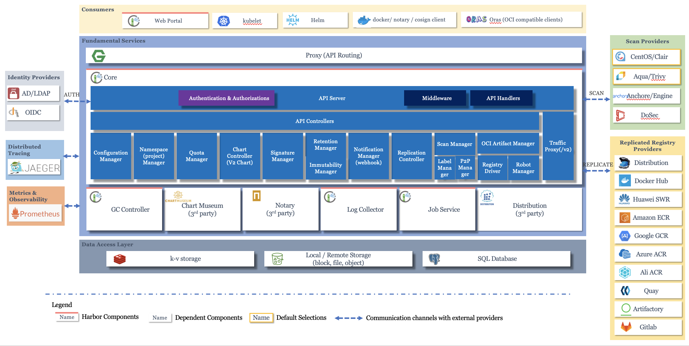

# harbor

- [harbor](#harbor)
  - [harbor arch](#harbor-arch)
  - [install by helm](#install-by-helm)
  - [proxy to get helm images](#proxy-to-get-helm-images)
  - [harbor仓库构成](#harbor仓库构成)
  - [harbor接口](#harbor接口)
  - [harbor cli](#harbor-cli)

## harbor arch



## install by helm

获取 harbor helm chart

```shell
helm repo add harbor https://helm.goharbor.io

helm fetch harbor/harbor --untar
```

安装 harbor
- `expose.type`: harbor 服务的暴露方式
- `expose.tls.auto.commonName`: CA验证的域名名称，需要与 `externalURL` 中的相同
- `externalURL`: 用来进行登陆重定向，默认拉取的url

```shell
helm -n harbor install --create-namespace \
  --set expose.type=nodePort \
  --set expose.tls.auto.commonName=gluenet.registry.io \
  --set externalURL=https://gluenet.registry.io:30003  \
  harbor harbor
```

## proxy to get helm images

```shell
ver=v2.7.0
repo=goharbor

for image in chartmuseum-photon redis-photon trivy-adapter-photon notary-server-photon notary-signer-photon harbor-registryctl registry-photon nginx-photon harbor-jobservice harbor-core harbor-portal harbor-db; do \
docker save ${repo}/${image}:${ver} | gzip >  ${image}.tar.gz ;done


for image in chartmuseum-photon redis-photon trivy-adapter-photon notary-server-photon notary-signer-photon harbor-registryctl registry-photon nginx-photon harbor-jobservice harbor-core harbor-portal harbor-db; do \
minikube -p harbor cp harbor:/home/docker/${image}.tar.gz  /home/fhl/harborimg/${image}.tar.gz  ;done


for image in chartmuseum-photon redis-photon trivy-adapter-photon notary-server-photon notary-signer-photon harbor-registryctl registry-photon nginx-photon harbor-jobservice harbor-core harbor-portal harbor-db; do \
docker load -i ${image}.tar.gz ;done
```

## harbor仓库构成

registry(default harbor, add by proxy)
- project
  - repository
    - artifact
## harbor接口

harbor 接口入口

```
https://<entry>/devcenter-api-2.0
```

## harbor cli

```
# v2 Client
go get github.com/mittwald/goharbor-client/v5/apiv2
```

```go
import (
  "github.com/mittwald/goharbor-client/v5/apiv2"
)
```